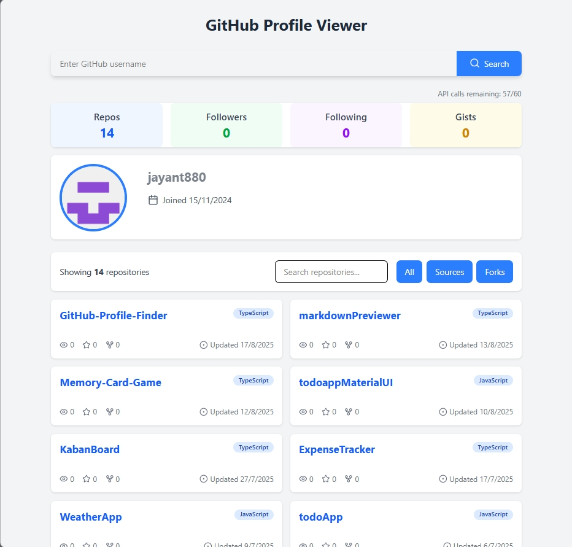
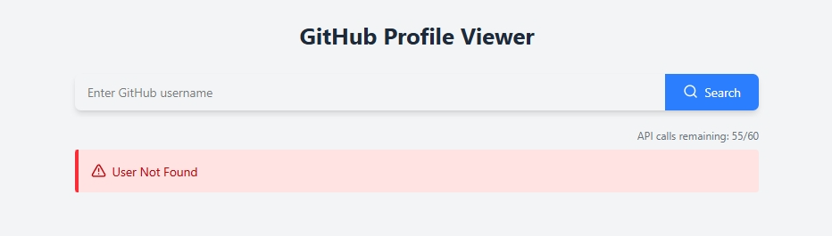

# GitHub Profile Viewer

A beautiful interface for viewing GitHub profiles and repositories.

## Demo
[Demo](https://git-hub-profile-finder-ten.vercel.app/)

## Screen Shot

### error


## Features

- 🔎 Search any GitHub user
- 👤 View profile details (bio, location, stats)
- 📂 Browse repositories with:
  - 🔍 Search by name/description
  - 🏷️ Filter by source/forks
- 📊 See repository stats (stars, forks, watchers)
- 🎨 Clean, responsive design

## How to Use

1. Enter a GitHub username
2. View their profile information
3. Explore their repositories
4. Use filters to find specific repos

## Built With

- React + TypeScript
- Tailwind CSS
- Lucide Icons
- GitHub API

## Installation

1. Clone the repo:
```bash
git clone git@github.com:jayant880/GitHub-Profile-Finder.git
```
2. Navigate to the project directory: 
```bash
cd GitHub-Profile-Finder
```
3. Install dependencies:
```bash
npm install
```
4. Start the development server
```bash
npm run dev
```
5. open the browse `http://localhost:5173`

## Project Structure
```
src/
├── components/ # UI components
├── types/ # Type definitions
├── App.tsx # Main app
└── main.tsx # Entry point
```